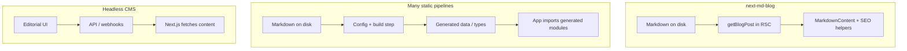

# Comparison

**next-md-blog** targets teams who want **posts as markdown files in git**, **App Router** pages they own, and **SEO helpers** without adopting a full CMS or a heavy codegen pipeline. This page compares common approaches; trade-offs depend on your team size, editorial workflow, and how much you want generated types.

## Feature overview

| Capability | **next-md-blog** | **Contentlayer** (historically) | **Velite** | **next-mdx-remote** | **Headless CMS** (e.g. Sanity, Payload) |
| --- | --- | --- | --- | --- | --- |
| **Content model** | Folders + `.md`/`.mdx` | Config + MD(X) → generated types | Config + build → data modules | You wire storage + MDX | Schemas + API |
| **Per-post metadata** | **YAML frontmatter in the post file** | Frontmatter → generated `Document` types | Frontmatter → generated data | Usually frontmatter; DIY | Fields in CMS; optional sync to files |
| **Sidecar / extra meta files per post** | **No** — not required | No for MDX; build emits **`.contentlayer`** | Build output dir (e.g. `.velite`) | Up to you | N/A (content not file-first) |
| **Build / codegen** | Optional CLI to scaffold; **runtime file read** | **Required** contentlayer build | **Required** velite build | None from library | Build is your app + API |
| **TypeScript types for posts** | Types for frontmatter via conventions + your types | Strong generated types | Strong generated types | DIY | Client SDK types |
| **SEO / RSS / sitemap** | Built-in helpers | DIY or plugins | DIY | DIY | Often via SDK + custom routes |
| **Non-technical editors** | Git / PR workflow | Same | Same | Same | **Strong** (dashboard, roles) |

## “No meta file” — what we mean

- **Per post:** you do **not** need a second file (for example `my-post.meta.json` or `my-post.yaml`) next to `my-post.md`. **Title, date, description, tags, authors** live in **frontmatter** at the top of the markdown file.
- **No mandatory generated cache** for the content graph: the core path is **read markdown from disk** at request/build time (with familiar Next caching patterns), not “compile all documents into a parallel database” — though you can still add your own caching layer if you need it.
- **Site-wide:** you typically keep **one** `next-md-blog.config.ts` for defaults (site URL, default author, author directory). That is **blog config**, not a per-post meta file sprawl.

## When **next-md-blog** is a strong fit

- You already want **markdown in the repo** and **PR-based** publishing.
- You want **Server Components** and normal **App Router** files, not a framework inside the framework.
- You prefer **one file per post** and **minimal moving parts** over maximum generated type safety from a pipeline.

## When to consider something else

- **Velite / similar** if you want **generated `data/*.json` or TS modules**, strict schemas, and a single `velite build` as the source of typed content — at the cost of an extra build step and output artifacts.
- **next-mdx-remote** if you need **remote MDX strings** (e.g. from a DB) or you want the **smallest possible** abstraction and will implement everything else yourself.
- **A CMS** if **non-developers** publish daily, you need **workflows, previews, and permissions**, or content should **not** live primarily in git.

## Notes on maintenance and ecosystem

Tooling around Next.js changes quickly. **Contentlayer** was widely used but the original project is no longer actively maintained; community forks exist. **Velite** is a modern alternative in the same “build step → typed content” space. **next-md-blog** deliberately stays smaller: **filesystem in, React + SEO helpers out**, with **frontmatter as the only post-level metadata surface** you must maintain.

---

[← Back to Home](/) · [Getting started](/getting-started) · [Configuration](/configuration)
