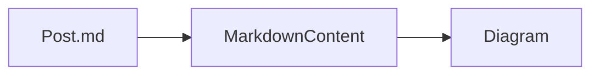

# Content & frontmatter

## Files and location

- Posts live under the directory declared on the collection (e.g. `defineCollection({ contentDir: 'content/blog' })`).
- Supported extensions: **`.md`** and **`.mdx`**.
- The **slug** is the filename without extension (e.g. `hello-world.md` → slug `hello-world`).
- For locale subfolders, pass `opts.locale` when reading — the collection resolves `${contentDir}/${locale}/`.

## Frontmatter (`BlogPostFrontmatter` / `BaseFrontmatter`)

Frontmatter is parsed by a small built-in parser backed by [js-yaml](https://github.com/nodeca/js-yaml) (YAML 1.1). Only a top-level mapping is accepted — a scalar or sequence block yields empty data and leaves the body untouched. Known fields:

| Field | Type | Notes |
| --- | --- | --- |
| `title` | `string` | Display / SEO title |
| `date` | `string` | Used for sorting lists (newest first) and dates in metadata |
| `updated` | `string` | Drives `dateModified` in JSON-LD and `lastmod` in the sitemap |
| `description` | `string` | Meta description |
| `author` | `string`, object with `name`, or array of those | Normalized with site `authors` |
| `authors` | Array of strings or `{ name }` objects | Same normalization |
| `tags` | `string[]` | Keywords / article tags |
| `ogImage` | `string` | Custom Open Graph image URL |
| `image` | `string` | Featured image; fallback for OG |
| `robots` | `string` | Robots meta directive |
| `noindex` / `nofollow` | `boolean` | SEO helper flags |
| `readingTime` | `number` | Minutes; if omitted, computed from body |
| `schema` | `object` | Merged into generated JSON-LD |
| `series` / `seriesTitle` / `seriesOrder` | `string` / `string` / `number` | Joins a topic cluster; emits `isPartOf` in JSON-LD and groups posts via `getBySeries` |
| `reviewedBy` / `factCheckedBy` / `lastReviewed` | `string` | E-E-A-T signals surfaced in JSON-LD |
| `alternateLanguages` | `Record<string, string>` | Per-post hreflang override |
| `canonicalUrl` | `string` | Override the URL used in canonical, OG, JSON-LD |
| `faq` | `FaqItem[]` | Emits a Schema.org `FAQPage` node in `schemaGraph` (since v1.3) |
| `howto` | `HowToFrontmatter` | Emits a Schema.org `HowTo` node in `schemaGraph` (since v1.3) |

Additional keys are allowed (`[key: string]: unknown`) and remain on **`frontmatter`**.

### SEO-related frontmatter aliases

Metadata and schema resolution also look at optional aliases such as **`seoTitle`**, **`seoDescription`**, **`excerpt`**, **`publishedDate`**, **`modifiedDate`**, **`category`**, **`lang`**, **`imageAlt`**, and **`type`** (Schema.org `@type`, default `BlogPosting`).

### Custom JSON-LD merge

If **`frontmatter.schema`** is a plain object, it is merged on top of the schema produced by the collection's `schemaBuilder` (BlogPosting by default), so you can add or override fields per post.

### FAQ and HowTo structured data (since v1.3)

Add **`faq`** and/or **`howto`** to a post's frontmatter and `collection.schemaGraph(...)` automatically appends a Schema.org **`FAQPage`** and/or **`HowTo`** node to the emitted `@graph` — no extra wiring. An empty/absent value is ignored.

```md filename="content/blog/deploy-guide.md"
---
title: Deploy a Next.js blog
description: From clone to production.
faq:
  - question: Do I need a database?
    answer: No — posts are Markdown files in your repo.
  - question: Does it support the App Router?
    answer: Yes, it is App Router–native.
howto:
  name: Deploy the blog
  totalTime: PT15M
  tool: [Node.js, Vercel CLI]
  steps:
    - name: Install
      text: Run `npm install @next-md-blog/core`.
    - name: Deploy
      text: Push to your Vercel project.
---
```

- **`FaqItem`** — `{ question, answer }`.
- **`HowToFrontmatter`** — `{ steps: [{ name, text, image?, url? }], name?, description?, totalTime?, estimatedCost?, supply?, tool?, yield?, image? }`. `steps` is required (Google needs ≥ 1).

## `ContentDoc` vs `ContentMetadata`

- **`ContentDoc<T>`** — full document: `slug`, `content`, `frontmatter`, **`readingTime`**, **`wordCount`**, **`authors`** (normalized).
- **`ContentMetadata<T>`** — listing shape: `slug`, `frontmatter`, **`authors`** (no `content`).

**`Collection.getAll()`** returns **`ContentMetadata<T>[]`**, sorted by `frontmatter.date` descending (string compare).

## Markdown rendering

**`<MarkdownContent />`** uses **`react-markdown`** with **GFM** and **emoji** remark plugins by default. Pass **`remarkPlugins`** / **`rehypePlugins`** only from trusted packages; custom plugins can change HTML output and security characteristics.

**`defaultMarkdownComponents`** exports the default element map used by **`MarkdownContent`**; you can merge overrides via the **`components`** prop.

### Mermaid diagrams (since v1.4)

A fenced **` ```mermaid `** block is rendered as a diagram instead of a code block. [`mermaid`](https://www.npmjs.com/package/mermaid) is an **optional peer dependency** (`^11`) — install it in your app to enable rendering:

```bash
npm install mermaid
```

It loads lazily on the client, so it only ships on pages that contain a diagram, and renders with `securityLevel: 'strict'`. If `mermaid` is not installed (or rendering fails), the raw source is shown as a normal code block — which also serves as the crawlable, no-JS fallback.

````md

````
