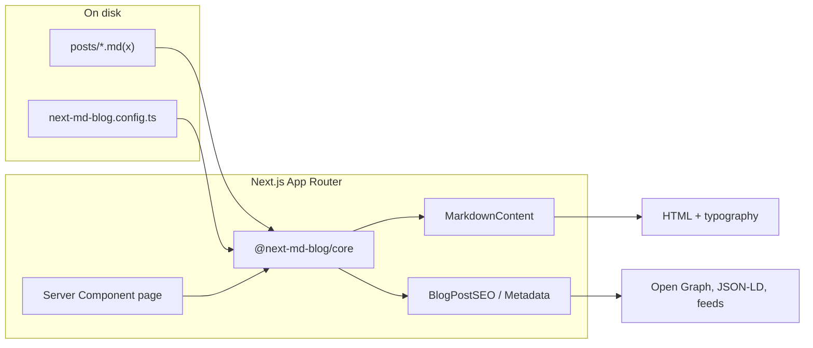
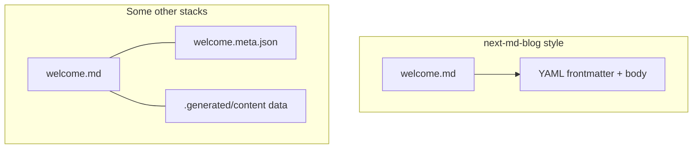

import { Cards } from 'nextra/components'

# next-md-blog

**Markdown-first blogging for [Next.js](https://nextjs.org)**. Keep posts as `.md` / `.mdx` on disk, load them in Server Components with **`getBlogPost`** / **`getAllBlogPosts`**, render with **`MarkdownContent`**, and ship **metadata**, **JSON-LD**, **RSS**, and **sitemap** helpers — plus an optional **CLI** to scaffold routes, config, **sitemap / robots / RSS** routes, and a dedicated **`seo`** subcommand to refresh those files.

<Cards>
  <Cards.Card title="Getting started" href="/getting-started" arrow />
  <Cards.Card title="CLI reference" href="/cli" arrow />
  <Cards.Card title="Comparison" href="/comparison" arrow />
  <Cards.Card title="API reference" href="/api-reference" arrow />
</Cards>

## Why it’s different

- **Metadata lives in frontmatter** — title, date, description, tags, and authors stay in the **same file** as the article. There is **no separate per-post meta file** (no `post.json` next to `post.md`) and **no generated content manifest** you have to treat as a second source of truth for simple blogs.
- **Optional site config** — one TypeScript module (`next-md-blog.config.ts`) for defaults and authors, not a parallel metadata tree for every post.
- **App Router–native** — fetch posts in RSC route handlers; no extra runtime CMS required for file-based workflows.
- **Small surface area** — core library + initializer; you keep control of layouts and styling.

## How it fits in your Next.js app

When a reader opens a post, data flows from disk through the core helpers into your page and SEO components:



**Idea:** your routes stay ordinary Next.js files; the library handles **reading**, **parsing frontmatter**, **markdown → React**, and **SEO primitives**.

## One source of truth per post

Many toolchains introduce **extra artifacts**: sidecar JSON/YAML, or a **generated layer** (for example a build step that emits typed documents and a cache directory). **next-md-blog** keeps the model flat for typical blogs: **one markdown file** carries both prose and metadata.



You still add **one optional** blog-wide config file for site URL, default author, and shared author objects — that is **not** a per-post meta file and stays easy to reason about.

## Packages

<div className="overflow-x-auto not-prose [&_th]:text-left [&_td]:align-top [&_th]:border-b [&_td]:border-b [&_th]:border-neutral-200 [&_td]:border-neutral-200 dark:[&_th]:border-neutral-800 dark:[&_td]:border-neutral-800 [&_th]:py-2 [&_td]:py-2 [&_th]:pr-4 [&_td]:pr-4">

| Package | Role |
| --- | --- |
| <span className="whitespace-nowrap">[`@next-md-blog/core`](https://www.npmjs.com/package/@next-md-blog/core)</span> | Posts, rendering, SEO helpers, feeds |
| <span className="whitespace-nowrap">[`@next-md-blog/cli`](https://www.npmjs.com/package/@next-md-blog/cli)</span> | Scaffold routes, config, **sitemap / robots / RSS (`feed.xml`)**, optional OG; **`seo`** subcommand to add or update SEO routes; **`--force`** to overwrite |

</div>

## Requirements

- **Next.js** `^16` and **React** `^19` (peers of `@next-md-blog/core`)
- **Node.js** 18+

## Compared to other options (short)

| | **next-md-blog** | Typical file-pipeline tools | Headless CMS |
| --- | --- | --- | --- |
| **Post metadata** | Frontmatter in the `.md`/`.mdx` file | Often config + generated docs or sidecars | Schema in the CMS |
| **Build step** | Optional CLI once; runtime reads files | Often required codegen / cache dir | API + preview |
| **Best for** | Own your markdown in-repo | Heavy typing & content graphs | Editorial workflows, non-dev authors |

See the full **[Comparison](/comparison)** page for stack-by-stack notes.

## Where to go next

- [Getting started](/getting-started) — install, CLI, first routes
- [CLI reference](/cli) — flags, **`seo`** subcommand, **`--force`**
- [Configuration](/configuration) — `createConfig` and site settings
- [Content & frontmatter](/content-and-frontmatter) — fields and conventions
- [Internationalization](/internationalization) — locale segments and folders

## This documentation site

Published at **[www.next-md-blog.com](https://www.next-md-blog.com)**. Clone the monorepo and run:

```bash
git clone https://github.com/next-md-blog/next-md-blog.git
cd next-md-blog
pnpm install
pnpm dev:docs
```

Open **http://localhost:5101** (see `docs/package.json`). Production hosting: [Deployment](/deployment).

**Live demos:** [demo.next-md-blog.com](https://demo.next-md-blog.com) (single locale) · [demo.i18n.next-md-blog.com](https://demo.i18n.next-md-blog.com) (i18n).

## Deploy on Vercel

Standalone starters (no monorepo clone) — see [Demos](/demos) and [Deployment](/deployment#one-click-templates-on-vercel).

**Single locale**

[](https://vercel.com/new/clone?repository-url=https%3A%2F%2Fgithub.com%2Fnext-md-blog%2Fnext-md-blog%2Ftree%2Fmain%2Ftemplates%2Fsingle%2F)

**i18n**

[](https://vercel.com/new/clone?repository-url=https%3A%2F%2Fgithub.com%2Fnext-md-blog%2Fnext-md-blog%2Ftree%2Fmain%2Ftemplates%2Fi18n)
